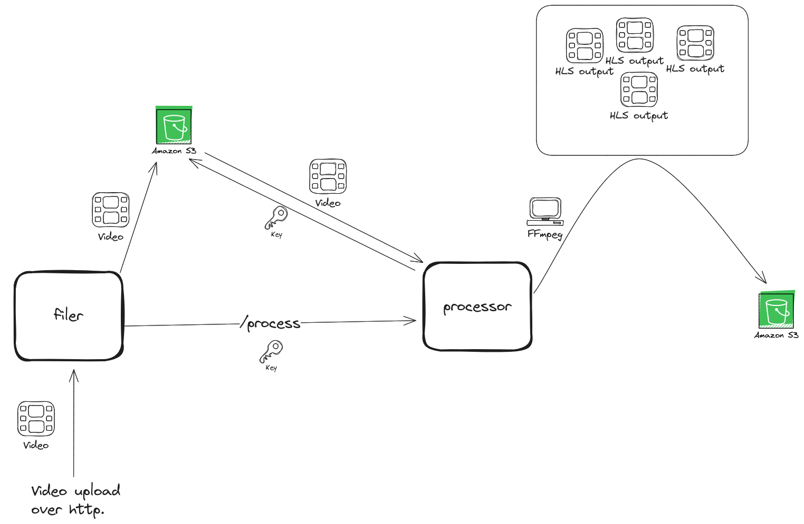

# (WIP)

Video streaming app/platform for learning purposes.
Main goals are to learn about video streaming with hls and ffmpeg and how to build a scalable and reliable system for this kind of handling.

### Features
Some features I want to implement:
- [ ] Video streaming with hls
- [ ] Multi-bitrate streaming
- [ ] Video transcoding/processing
- [ ] Advertisement insertion

### Good content / References
- [FULL STREAMING POWER! HLS And DASH On A Nginx Server With RTMP Support - A Complete Walkthrough](https://youtu.be/zOPu26W48AA)
- [Let's use FFmpeg! playlist](https://youtube.com/playlist?list=PLOQsURf6CFX1A_Cpxc-0rydtyO5gD6DrY&si=fcXsum_6Zo1alJfu)

### Current structure

